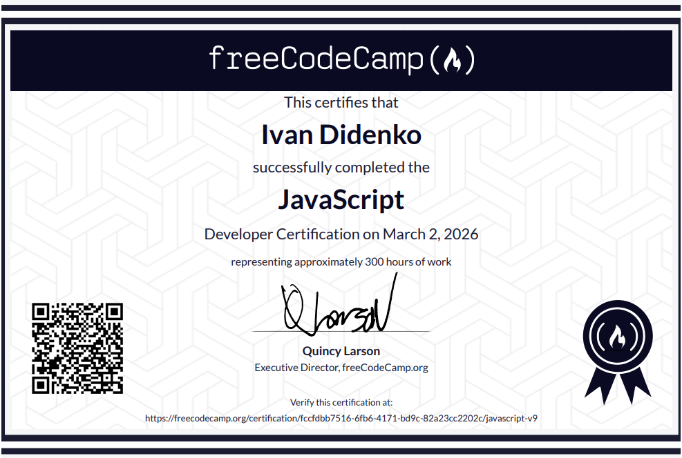
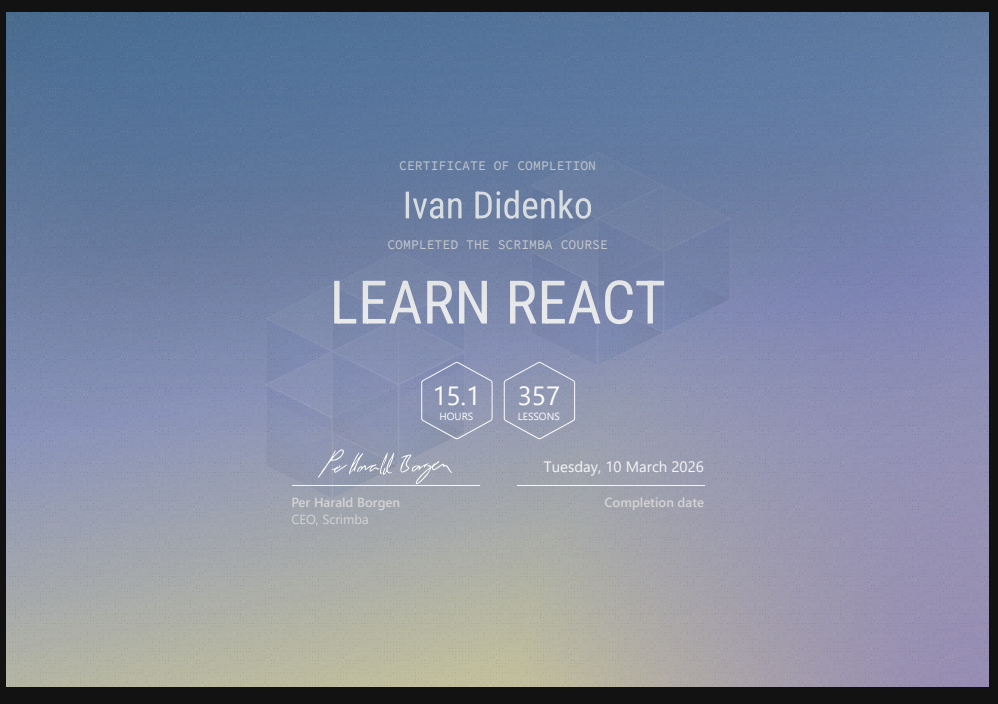
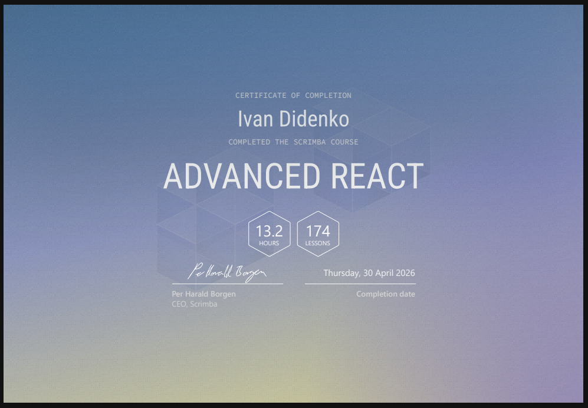
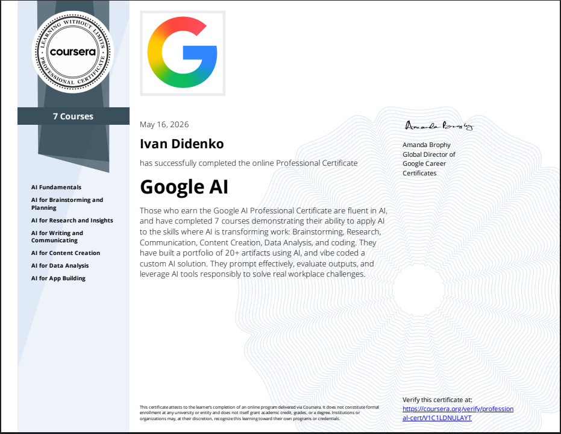

---

# Hey, I'm Ivan Didenko 👋

### · Frontend Developer · 

---

## ⚡ About Me

- **Analytical DNA**: A mathematician at heart with a lifelong "tech-first" mindset. I don't just write code; I architect logical solutions.
- **Resilience-Driven Growth**: Transitioned from 10 years in the service industry to Software Engineering while serving in the Armed Forces of Ukraine. This journey has forged elite **time management** and **deep focus** skills.
- **Tech Stack**: Specialized in building modern web applications with **React**, **JavaScript (ES6+)**, and **Vite**.
- **AI Integration & Expertise**: Completed the **Google AI Specialization** and actively implementing **Gemini**, **Groq**, and **HuggingFace** APIs to build smarter, future-ready tools.
- **Future Mission**: Seeking to contribute to **MilTech** innovations or join an international team to build complex, high-impact interfaces. Available for both remote and office-based roles.

---

## 🎓 Certifications

> Click the clickable images above to view verifications. The links will open in the current tab (press `Ctrl + Click` or `Cmd + Click` to open in a new tab).

> Click the clickable images above to view verifications. The links will open in the current tab (press `Ctrl + Click` or `Cmd + Click` to open in a new tab).

---

## 📚 Learning Path

* **Current Focus**: 🏗️ Deep diving into **Next.js** to build high-performance, SEO-friendly applications with Server-Side Rendering (SSR).
* **Up Next**: 🛡️ **TypeScript** for type safety and **Tailwind CSS** for rapid, modern UI development.

---

## 🛠 Tech Toolbox

| Category | Tools |
| :--- | :--- |
| **Frontend** | `HTML5` `CSS3` `JavaScript` `React` `Vite` |
| **Backend/Cloud** | `Firebase` `Netlify` |
| **AI/Models** | `Google AI` `Gemini` `Groq` `HuggingFace` |
| **Version Control** | `Git` `GitHub` |

---

## 🤝 Soft Skills & Productivity

- **Analytical Problem Solving**: Leveraging a mathematical mindset to deconstruct complex technical challenges into logical solutions.
- **Resilience & Focus**: Proven ability to maintain deep focus and deliver results under high-pressure environments.
- **Extreme Discipline**: Mastering professional growth through 3-hour deep work blocks while maintaining military duties.
- **Reliable Teamwork**: Strong sense of accountability and collaboration, forged through high-stakes team environments.

---

## 🛠️ Tech Stack

---

## 🚀 Featured Projects

### 🍳 [freeCodeCamp JavaScript Algorithms and Data Structures](https://github.com/ivandidenkoweb/freecodecamp-javascript-path)
> **JavaScript (ES6+) · HTML5, CSS3, Markdown · Fetch API, REST Services · LocalStorage, Web Storage API**

This repository represents my complete learning journey through the freeCodeCamp curriculum. It contains all modules, ranging from fundamental basics to complex asynchronous applications and final certification projects.

---

### 🍳 [Chef Claude](https://github.com/ivandidenkoweb/chef-claude) · [Live Demo ↗](https://ivandidenko-chef-claude.netlify.app/)
> **React 18 · Vite · Groq API · Meta Llama**

Tell it what's in your fridge. Get a real recipe back. Powered by AI.  
Built with React components, async API calls, `.env` security, and `react-markdown` rendering.

---

### 🧠 [Quizzical](https://github.com/ivandidenkoweb/quizzical) · [Live Demo ↗](https://ivandidenko-quizzical.netlify.app/)
> **React 19 · Vite · Open Trivia DB API · react-confetti**

Trivia quiz app, live API questions, confetti for perfect scores.  
Full game flow, answer feedback, dynamic class names with `clsx`.

---

### 🎲 [Tenzies](https://github.com/ivandidenkoweb/tenzies-game) · [Live Demo ↗](https://ivandidenko-tenzies-game.netlify.app/)
> **React 19 · Vite · nanoid · react-confetti**

Dice game with real pip visuals, live timer and confetti.  
Full keyboard accessibility with `aria-pressed`, `aria-live` regions throughout.

---

### 🚐 [VanLife](https://github.com/ivandidenkoweb/vanlife) · [Live Demo ↗](https://ivandidenko-vanlife.netlify.app/)
> **React 19 · Firebase · React Icons · LocalStorage React · Router DOM 6**

VanLife is a full-stack React application that enables users to browse and rent vans for their adventures.  
Multi-page architecture, `async/await`, error handling, responsive user interfaces, implementing client-side routing with React Router.

---

I am open to collaboration on MilTech projects or complex React applications. Let's build something impactful together!
